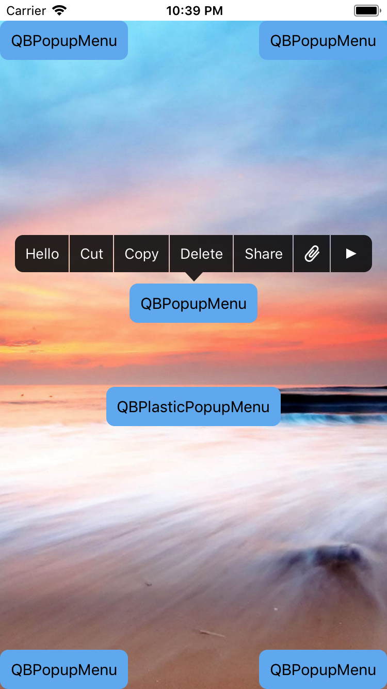
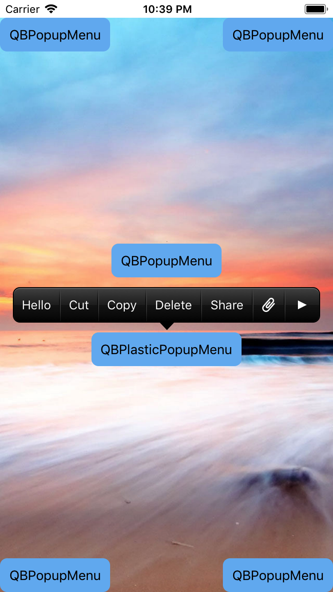

# QBPopupMenuSwift
Customizable popup menu for iOS. Forked and rewritten to Swift from <a href="https://github.com/questbeat/QBPopupMenu">questbeat/QBPopupMenu</a>

**QBPopupMenuSwift version 1.0 is now available.**  
Its appearance is similar to `UIMenuController` of iOS 7, and it has several new features.

* Code was completely rewritten and modified to match Swift 4.0 language features, some improvements and cleanup was also performed  
* Project organization was flattened
* Configuration of popup menu separated to own object

**Bug reports, patches, suggestions or any other feedback is highly welcome!**

## Screenshot

## Manual installation

Copu QBPopupMenu.swift optionally with QBPlasticPopupMenu.swift to your project.

## Feature
### Customizable Appearance
QBPopupMenu is highly customizable, so you can create your own popup menu.

The simple way to customize is set `color` and `highlightcolor` property of `QBPopupMenu` config object passed to initializer. If you want to customize deeply, you should create a subclass of `QBPopupMenu` and override some drawing methods.

`QBPlasticPopupMenu` class in this repository is a good example of subclassing.

### Auto Pagenation
If you add many items to `QBPopupMenu`, it create pages and pagenator automatically.

### Auto Bounding
`QBPopupMenu` automatically adjust its frame depending on the frame of target view.

## Example
	import UIKit
	
	class ViewController: UIViewController {
	
	    var menuItems: [QBPopupMenu.Item] {
	        return [
	            QBPopupMenu.Item(title: "Hello",                                    action: { self.action() }),
	            QBPopupMenu.Item(title: "Cut",                                      action: { self.action() }),
	            QBPopupMenu.Item(title: "Copy",                                     action: { self.action() }),
	            QBPopupMenu.Item(title: "Delete",                                   action: { self.action() }),
	            QBPopupMenu.Item(title: "Share",                                    action: { self.action() }),
	            QBPopupMenu.Item(image: UIImage(named: "clip"),                     action: { self.action() }),
	            QBPopupMenu.Item(title: "Delete", image: UIImage(named: "trash"),   action: { self.action() }),
	        ]
	    }
	    
	    override func viewDidLoad() {
	        super.viewDidLoad()
	    }
	
	    override func didReceiveMemoryWarning() {
	        super.didReceiveMemoryWarning()
	    }
	
	    @IBAction func displayMenu(_ sender: Any) {
	        let button = sender as! UIButton
	        let popupMenu = QBPopupMenu(items: menuItems)
	        popupMenu.showIn(parentView: view, targetRect: button.frame, animated: true)
	    }
	    
	    @IBAction func displayPlasticMenu(_ sender: Any) {
	        let button = sender as! UIButton
	        let popupMenu = QBPlasticPopupMenu(config: QBPopupMenu.Config(height: 40), items: menuItems)
	        popupMenu.showIn(parentView: view, targetRect: button.frame, animated: true)
	    }
	    
	    func action() {
	        print("QBPopupMenuAction!")
	    }
	}

## License
*QBPopupMenu* and *QBPopupMenuSwift* is released under the **MIT License**, see *LICENSE.txt*.
